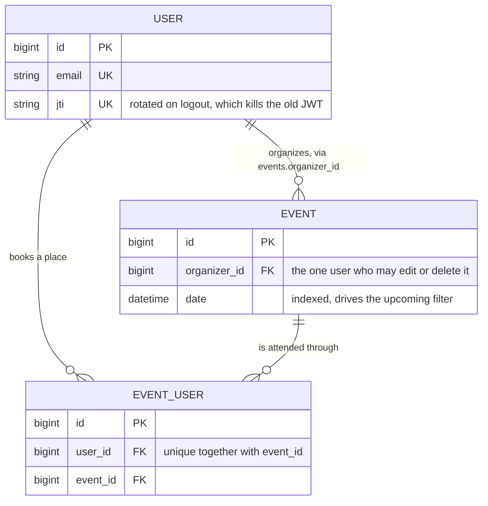
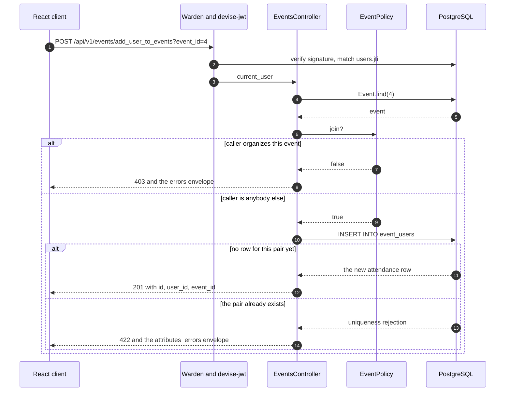

# Event Management API

A Rails 7.1 API-only service for organising events and booking a place at someone
else's. No views, no assets, no HTML — every response is JSON. The consumer is the
React client in the sibling repository `event_management_FE`, whose `package.json`
describes itself as "React client for the event_management_app_BE Rails API".
Eleven endpoints: signup, login, logout, and eight under `/api/v1/events`, with a
bearer JWT handed back in the `Authorization` **response header** of `POST /login`.

## Run it

Ruby 3.2.2 (`.ruby-version`) and a PostgreSQL server.

```bash
bundle install
cp .env.example .env          # fill in DATABASE_* if your PostgreSQL needs credentials
bin/rails db:create db:schema:load db:seed
bin/rails server              # http://localhost:3000
```

`db:seed` is idempotent. It creates three users — `ada@example.com`,
`grace@example.com`, `alan@example.com`, password `password123` — six events (one
deliberately in the past, so the upcoming filter has something to exclude) and a few
bookings, so every list endpoint returns rows immediately. The token arrives in a
*header*, so grab it from one and send it back in the other:

```bash
TOKEN=$(curl -sD - -o/dev/null -X POST localhost:3000/login -H 'Content-Type: application/json' \
  -d '{"user":{"email":"ada@example.com","password":"password123"}}' \
  | tr -d '\r' | awk 'tolower($1)=="authorization:"{print $2" "$3}')
curl -s -H "Authorization: $TOKEN" localhost:3000/api/v1/events
```

Every path, status code and body shape is in
[`docs/api-contract.md`](docs/api-contract.md).

## Two ways a user relates to an event

Almost every rule in this codebase falls out of one detail of the schema: a user
reaches an event down **two different edges**. `events.organizer_id` is ownership; a
row in `event_users` is a booking. They are mutually exclusive by policy, and the
second is unique per pair.



The plain string columns are omitted above; `db/schema.rb` is the full list. The two
edges need distinct association names, `has_many :organized_events` and
`has_many :events, through: :event_users` — `app/models/user.rb` carries a note about
what happened when they did not. The three list endpoints slice those edges:

| Endpoint | Scope | Reads |
|---|---|---|
| `GET /api/v1/events` | `Event.organized_by_user` | events you own |
| `GET /api/v1/events/joined_events` | `current_user.events` | events you have booked |
| `GET /api/v1/events/get_events` | `Event.not_joined_by_user` + `upcoming_events` | future events on neither edge |

`not_joined_by_user` is the only non-obvious one: it excludes your own events with a
plain `WHERE` and your bookings with a correlated `NOT EXISTS`, in one statement
served by the unique index. The comment above the scope in `app/models/event.rb`
records what it replaced, and
[`docs/captured/query-benchmark.txt`](docs/captured/query-benchmark.txt) has the
`EXPLAIN ANALYZE` and the timings (20,000 events with 5,000 booked: 15.7 ms over 3
queries down to 0.2 ms over 1).

## Booking a place, and the two ways it is refused

A booking is one `POST /api/v1/events/add_user_to_events?event_id=:id`. It can be
refused for exactly two domain reasons, enforced in two different places — one in
Ruby, one in PostgreSQL.



**You cannot book your own event.** `EventPolicy#join?` is
`user.present? && !organizer?`. An organizer is already attending, and
`not_joined_by_user` filters their event out of the joinable list anyway, so the row
would have been unreachable from every endpoint that could show it.

**You cannot book the same event twice.** `EventUser` validates uniqueness of
`user_id` scoped to `event_id`, *and* `event_users(user_id, event_id)` is a unique
index. The index is not redundant — a validation is a `SELECT` then an `INSERT`, and two
concurrent requests can both pass the `SELECT`. `spec/models/event_user_spec.rb` pins
both halves: its second example saves with `validate: false` and asserts
`ActiveRecord::RecordNotUnique`, which only the index can raise. Verbatim from
[`docs/captured/api-session.txt`](docs/captured/api-session.txt):

```
$ curl -s -i -X POST ".../add_user_to_events?event_id=4" -H "Authorization: $GRACE"
HTTP/1.1 201 Created
{"id":7,"user_id":2,"event_id":4}

$ curl -s -i -X POST ".../add_user_to_events?event_id=4" -H "Authorization: $GRACE"
HTTP/1.1 422 Unprocessable Content
{"attributes_errors":{"user_id":["User can join the same event only once"]}}
```

Omitting `event_id` altogether is a 400, not a 422 — nothing was validated.

## Who may do what

`app/policies` answers one question per action; `ApplicationPolicy` denies everything by
default, and `Authorization#authorize!` **raises** rather than returning false, so an
endpoint that forgets to ask fails closed. `spec/requests/api/v1/events_authorization_spec.rb`
walks the cross-user matrix over real HTTP with real JWTs; `spec/policies/` tests the
predicates on their own.

| Action | Rule |
|---|---|
| `show?` | any signed-in user — the joinable list links straight to an event you do not own |
| `create?` | any signed-in user, and `organizer_id` is always the caller |
| `update?`, `destroy?` | the organizer only, otherwise 403 |
| `join?` | any signed-in user who is *not* the organizer |

## Evidence on disk

No UI, so the evidence is request/response pairs. Everything under `docs/captured/`
is literal command output with the generating command printed above it:

- [`api-session.txt`](docs/captured/api-session.txt) — 21 curl exchanges against a booted server: health probe, signup, login, all eight event endpoints, the 403/404/400/422 envelopes, logout and token revocation, CORS headers
- [`query-benchmark.txt`](docs/captured/query-benchmark.txt) — timings and `EXPLAIN ANALYZE` for `not_joined_by_user`, with the generating script beside it
- [`mutation-check.txt`](docs/captured/mutation-check.txt) — the suite deliberately broken and repaired, to show it can fail
- [`baseline-bug-probe.txt`](docs/captured/baseline-bug-probe.txt) — eight defects reproduced against an earlier checkout, before they were fixed
- [`json-3-regression.txt`](docs/captured/json-3-regression.txt) — why the Gemfile pins `json ~> 2.7`, demonstrated rather than asserted

## Environment

Nothing is read from source. `config/database.yml` and
`config/initializers/devise.rb` both read the environment.

| Variable | Required | Default | Purpose |
|---|---|---|---|
| `DEVISE_JWT_SECRET_KEY` | outside development and test | none — the initializer raises on boot if it is unset | Signs and verifies every JWT. Anyone holding it can mint a token for any user. Generate with `bin/rails secret` |
| `SECRET_KEY_BASE` | in production | none | Rails' own key derivation |
| `DATABASE_URL` | no | — | Full connection URL; overrides the four below |
| `DATABASE_HOST` / `DATABASE_PORT` | no | `localhost` / `5432` | |
| `DATABASE_NAME` / `DATABASE_USERNAME` / `DATABASE_PASSWORD` | no | `event_management_app_be_<env>` / the OS user / — | |
| `JWT_EXPIRATION_MINUTES` | no | `480` | Token lifetime |
| `CORS_ORIGINS` | no | `*` | Comma-separated. Pin it to the client's origin in anything real |
| `RAILS_MAX_THREADS` | no | `5` | Puma threads **and** the Active Record pool size |

Four more optional ones are in `.env.example`: `TEST_DATABASE_NAME`, `PORT` (`3000`),
`SEED_PASSWORD` (`password123`), and `PUMA_SOCKET_DIR`, which makes Puma bind a Unix
socket there instead of a TCP port.

`config/initializers/cors.rb` exposes `Authorization`, `X-Total-Count`, `X-Page` and
`X-Per-Page`. Without that expose list a browser cannot read the login token, while
every curl test stays green.

## Tests, lint, CI

`bundle exec rspec` and `bundle exec rubocop`. Last run on Ruby 3.2.2 against a local
PostgreSQL: `122 examples, 0 failures` and `60 files inspected, no offenses detected`.

The suite needs a real PostgreSQL — the schema enables `plpgsql` and
`not_joined_by_user` is raw SQL, so SQLite is not a substitute; point it at a
non-default instance with `DATABASE_HOST` / `DATABASE_PORT`. `.github/workflows/ci.yml`
runs both against `postgres:16-alpine` on every push and pull request.

### Docker

`docker compose up --build` puts the API on `:8690` and PostgreSQL on `:8695`, and
needs `DEVISE_JWT_SECRET_KEY` and `SECRET_KEY_BASE` in `.env`. The image is
multi-stage, runs as UID 1000 and healthchecks `/up` — none of which has been
exercised. The repository's own build report records:

> - Build verified: **NOT RUN — deferred, Docker off**
> - Boot verified: **NOT RUN — deferred, Docker off**

`docker compose config` parses cleanly. That is the whole of the verification.

## Two decisions worth explaining

**The endpoint names are wrong and they stayed wrong.** `add_user_to_events`,
`get_events` and `joined_events` are not names anyone would pick, and `get_events`
needs a RuboCop exemption to pass the linter. They are the exact paths
`event_management_FE` calls, so renaming them would buy tidiness at the only
consumer's expense. They kept their names and got comments instead.

**Responses are flat objects, not JSON:API envelopes.** The serializers are
`jsonapi-serializer` classes, but the controllers render only
`serializable_hash[:data][:attributes]`, the shape the client parses. One consequence
shows up in `EventSerializer`: its `has_many :users` never reaches a response body.

## Out of scope

- **No capacity, no waitlist.** `events` has no seat-count column, so a booking is never
  refused for being full. The only two domain refusals are the ones above.
- **No refresh tokens.** A JWT lives eight hours, then you log in again — no rotation,
  no sliding expiry. No rate limiting on `/login` or `/signup` either.
- **Offset pagination**, capped at 100 rows, default 50, reported in `X-Total-Count` /
  `X-Page` / `X-Per-Page`. A deep page still makes PostgreSQL count past the offset.
  `event_management_FE` does send `page` and `per_page` (`src/services/eventService.js:60`,
  pinned by `eventService.test.js:47`), so both ends of the contract are exercised — see
  the end of [`docs/api-contract.md`](docs/api-contract.md).
- **No caching, queue or read replica**, and no soft deletes: destroying an event
  destroys its bookings, and destroying a user destroys the events they organised.
- **`config/credentials.yml.enc` is committed without its `master.key`**, so nobody
  cloning this can decrypt it. Nothing reads from it — every secret comes from the
  environment — but deleting an encrypted file is a call for whoever holds the key.
- **`devise-jwt` 0.11 calls `Rails.application.secrets`**, deprecated in Rails 7.1 and
  removed in 7.2. The boot-time deprecation warning comes from the gem, not from this
  code; upgrading Rails needs that gem to move first.
